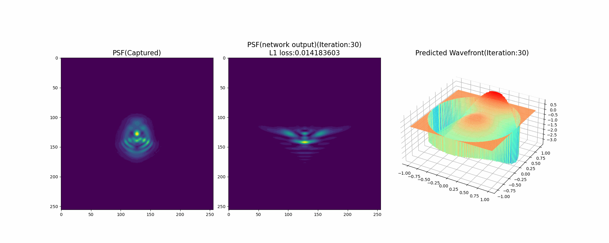

# Learning-Based Lens Wavefront Aberration Recovery
### [Paper](https://opg.optica.org/oe/fulltext.cfm?uri=oe-32-11-18931)

<p align="left" width="100%">
    
</p>

## Environment Requirements
The codes was tested on Windows 10, with Python and PyTorch. Packages required to reproduce the results can be found in `requirements.txt`. The following software / hardware is tested and recommended:
- numpy  
- tqdm
- Python >= 3.9
- matplotlib >= 3.5
- pytorch >= 2.0
- torchvision >= 0.15
- pandas >= 1.4

## File Structure
This repository contains codes for LWNet.
```
LWNet
|   README.md
|   requirements.txt
|   main_lwnet.py
|   statistic_zer_rule.py
|   demo.gif
|---data  
|---model
|---results  
```

`/data` include input data (GT). 

`/models` include models for Stage_I and Stage_II. 

`/results` store the optimization results.

## Test
To test LWNet and reproduce some results shown in the paper:
- Run `main_lwnet.py`. The outputs will be saved in `results` folders
- Modify parameters in `configs/lwnet.yaml`, run `main_lwnet.py`. The outputs will be saved in `results` folders

## Contact
For any question, you can contact chenliqun@pjlab.org.cn

## Citation
If you use this codebase or any part of it for a publication, please cite:
```
@article{chen2024learning,
  title={Learning-based lens wavefront aberration recovery},
  author={Chen, Liqun and Hu, Yuyao and Nie, Jiewen and Xue, Tianfan and Gu, Jinwei},
  journal={Optics Express},
  volume={32},
  number={11},
  pages={18931--18943},
  year={2024},
  publisher={Optica Publishing Group}
}
```
